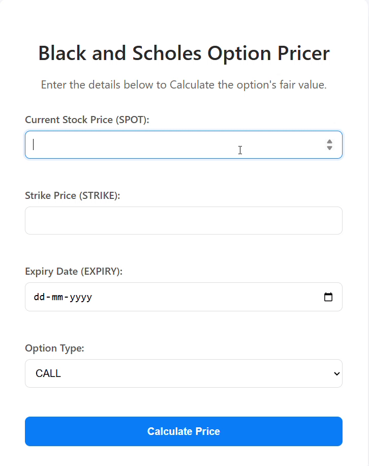

# Derivatives Pricing & Volatility Modeling Engine 📈


A full-stack, cloud-native application to calculate the fair price of financial options using the Black-Scholes model, featuring an AI-driven volatility prediction microservice. Built for demonstrating modern software engineering practices, including microservices, CI/CD, and cloud deployment.

## Demo



## Features

- Black-Scholes Pricing: Calculates theoretical prices for European Call and Put options.
- AI-Powered Volatility: Utilizes a Python microservice with a Scikit-learn model (trained on real market data) to predict implied volatility.
- Microservices Architecture: Decoupled Java backend and Python AI service for modularity and scalability.
- Containerized: Fully containerized using Docker for consistent environments.
- Automated CI/CD: GitHub Actions pipeline automatically builds and pushes images to AWS ECR on every push to main.
- Cloud Deployed: Live demonstration running on AWS EC2.


## Tech Stack

**Backend:** Java 21, Spring Boot 3.5.6, Python 3.14

**Frontend:** Thymeleaf, HTML5, CSS3

**DevOps:** Docker, Docker Compose, GitHub Actions

**Cloud:** AWS EC2, AWS ECR, AWS IAM


## Run Locally

Clone the project

```bash
  git clone https://github.com/swayraj/derivatives-pricer.git
```

Go to the project directory

```bash
  cd derivatives-pricer
```

Build and Run

```bash
  docker compose up --build
```

Access

```
  http://localhost:8080
```

Stop(Ctrl+C)

```bash
  docker compose down
```


## Deployment

To deploy this project run

```bash
  # Connect to your EC2 server via SSH
  ssh -i "your-key-file.pem" ubuntu@YOUR_EC2_PUBLIC_IP
```
```bash
  # Navigate into the project directory
  cd derivatives-pricer
```
```bash
  # Pull the latest code changes from GitHub
  git pull origin main
```
```bash
  # Refresh Docker's login token for AWS ECR
  aws ecr get-login-password --region YOUR_REGION | docker login --username AWS --password-stdin YOUR_ACCOUNT_ID.dkr.ecr.YOUR_REGION.amazonaws.com
```
```bash
  # Pull the newest Docker images specified in the compose file from ECR
  docker compose -f docker-compose.prod.yml pull
```
```bash
  # Restart the application containers using the new images (in detached mode)
  docker compose -f docker-compose.prod.yml up -d --force-recreate
```


## Contributing

Contributions are welcome!

✦︎Fork the repository.

✦︎Create a feature branch (git checkout -b feature/AmazingFeature).

✦︎Commit your changes (git commit -m 'Add some AmazingFeature').

✦︎Push to the branch (git push origin feature/AmazingFeature).

✦︎Open a Pull Request.


## Authors

- [@Swaraj Dhayarkar](https://www.github.com/swayraj)

